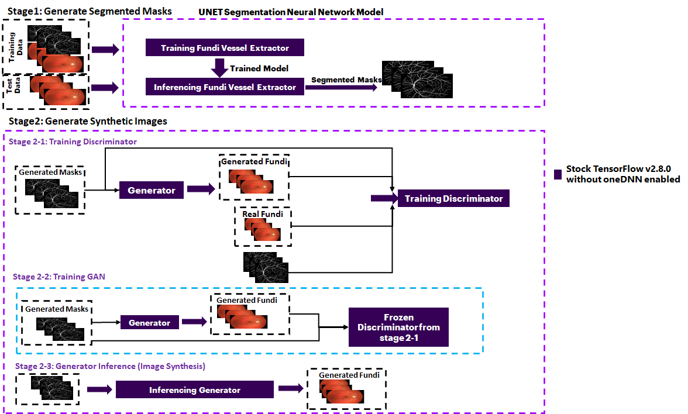
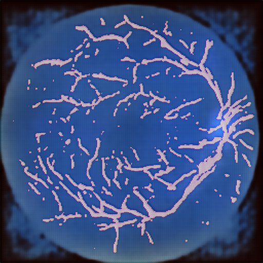
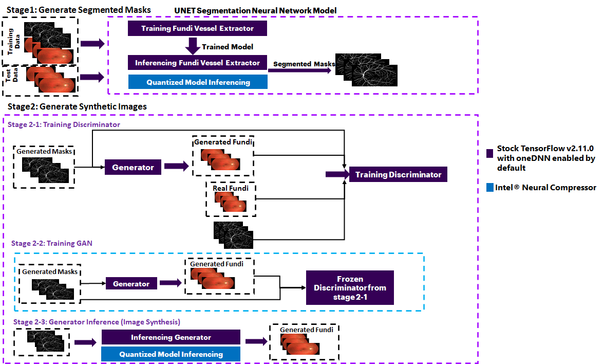
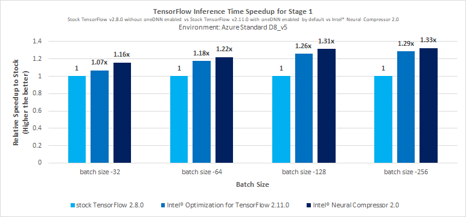
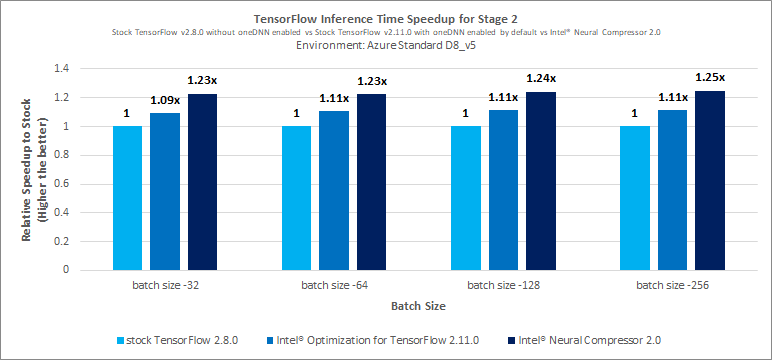

# Applications of Synthetic Image Generation 
## Introduction
Synthetic image generation is the process of creating new images using algorithms or simulations to substitute real-world data. [More Info](https://en.wikipedia.org/wiki/Synthetic_data)


## Table of Contents 
 - [Purpose](#purpose)
 - [Reference Solution](#reference-solution)
 - [Reference Implementation](#reference-implementation)
 - [Intel® Optimized Implementation](#optimizing-the-end-to-end-solution-with-intel%C2%AE-oneapi-components)
 - [Performance Observations](#performance-observations)

## Purpose
There is a growing interest in medical diagnosis systems using Deep Learning. However, due to proprietary and privacy reasons, the data access to the public has been very limited and thereby leading to limited public contributions in this field of study. Moreover, access to medical image data without expert annotations and accurate metadata, renders them useless for most modern applications. 
This has led to a larger interest in generating synthetic data - since these can be used for deep learning model training and validation while vastly reducing the costs of data collection and labeling.


A notable use case, in the medical industry, is to utilize synthetic data generation of retinal Images for vessel extraction. A detailed interpretation and study of the retinal vasculature rely on precise vessel segmentation, which is a very laborious and time taking task. Since public data sources of retinal images are very limited and are bound by strict privacy clauses. A synthetic data generation of the images helps to provide a larger data source to aid the model development from the existing and limited data sources.

In this reference kit, we demonstrate a reference implementation for this use case.


## Reference Solution 
An AI-enabled image generator aid helps to generate new accurate image and image segmentation datasets when the dataset is limited

In this reference kit, we consider a two-stage pipeline for generating synthetic medical images of retinal fundi using  generative adversarial networks :
1. Stage 1 - Generate segmented images from a U-Net model using a real dataset of fundi images.
2. Stage 2 - Generate synthetic retinal fundi image from a GAN model using a real dataset of fundi images and its segmented pairs generated in stage 1.


In Stage 1, a real fundus image is processed using a U-Net model to segment the vessel from the input fundus image. U-Net is a special type of CNN segmentation architecture that was designed to do biomedical image segmentation tasks. 
These segmented masks are then fed into Stage 2 together with real fundus images to generate fundus images synthetically.

Stage 2 is utilized to convert the segmentation masks into photorealistic fundus images. Stage 2 starts with training with real fundi and segmented vessel masks to determine the mapping between the two image classes. During Inferencing, a segmented vessel mask is fed as an input to the model which will transform the given segmented mask into a synthetic photorealistic fundus image.

Since GPUs are typically the choice for deep learning and AI processing to achieve a higher Frames Per Second (FPS) rate, to offer a more cost-effective 
option leveraging a CPU, we use the quantization technique, leveraging the Intel Analytics toolkit, to achieve high FPS by performing vectorized operations on the CPUs itself.

By quantizing/compressing the model (from floating point to integer model), while maintaining a similar level of accuracy as the floating point model, 
we demonstrate efficient utilization of underlying resources when deployed on edge devices with low processing and memory capabilities.


## Key Implementation Details
- Highlighted the difference between using Intel® Optimizations for TensorFlow* v2.11.0 against the packages of the stock version of the TensorFlow v2.8.0.
- Model has been Quantized using Intel® Neural Compressor which has shown high-performance vectorized operations on Intel® platforms.

## Reference Implementation
### Use Case End-To-End flow



### Reference Sources

*DataSet*: https://www5.cs.fau.de/research/data/fundus-images/ <br>
*Case Study & Repo*: https://github.com/diazandr3s/synthetic-medical-images (Retinal Fundus images)<br>

> ***Please see this data set's applicable license for terms and conditions. Intel®Corporation does not own the rights to this data set and does not 
confer any rights to it.***

### Dataset

| **Use case** | Synthetic Image Generation
| :--- | :---
| **Object of interest** | Synthetic Fundus Image Generation
| **Size** | Total 15 Images <br>
| **Train : Test Split** | 10 images for training and 5 images for testing
| **Source** | https://www5.cs.fau.de/research/data/fundus-images/

### Expected Input-Output for Stage 1
The input and output for Stage 1 are given below.
**Input**                                 | **Output** |
| :---: | :---: |
| Retinal Fundus Images        | Segmented Retinal Vessel Mask Images  |

### Expected Input-Output for Stage 2
The input and output for Stage 2 are given below.
**Input**                                 | **Output** |
| :---: | :---: |
| Segmented Retinal Vessel Mask Images        | Synthetic Retinal Fundus Images  |

### Software Requirements
Note that this reference kit implementation already provides the necessary scripts to set up the software requirements. 
1. Python - 3.9.7
2. TensorFlow - 2.8.0

> **Note**: If you beginning to explore the reference kits on client machines such as a windows laptop, go to the 
[Running on Windows](#running-on-windows) section to ensure you are all set and come back here

> **Note**: The performance measurements were captured on Xeon-based processors. The instructions will work on WSL, 
however, some portions of the ref kits may run slower on a client machine, so utilize the flags supported to modify the 
epochs/batch size to run the training or inference faster. Additionally, performance claims reported may not be seen on a 
windows based client machine.

> **Note**: In this reference kit implementation already provides the necessary conda environment configurations to set up the software requirements. 
To utilize these environment scripts, first, install Anaconda/Miniconda by following the instructions at the following link  
> [Anaconda installation](https://docs.anaconda.com/anaconda/install/linux/)

###  For cloning the repository  please execute below 
First clone the repository by executing the below command.
```
git clone https://github.com/oneapi-src/image-data-generation
cd image-data-generation
```

### Reference Solution setup
The below commands can be used to automate the creation of a conda environment for the execution of the algorithms.

>Note: It is assumed that the present **working directory is the root directory of this code repository**

Below are the developer environment used for this module on Azure. All the observations captured are based on these environment setups.

The below file is used to create a stock environment as follows:

|     **YAML file**     | **Environment Name** |            **Configuration**            |
|:---------------------:|----------------------|:---------------------------------------:|
| `env/stock/syntheticimagegeneration.yml` | `syntheticimagegeneration_stock`        | Python=3.9.7 with Stock TensorFlow v2.8.0 without oneDNN enabled |

Command to create the stock environment
```sh
conda env create --file env/stock/syntheticimagegeneration_stock.yml
```
Activate the stock environment
```sh
conda activate syntheticimagegeneration_stock
```
>Note: Please refer to known-issues section at the end in case of any libraries issues.

#### Reference Solution Implementation

### Data Preparation
We are using the 'High-Resolution Fundus (HRF) Image Database' from 'https://www5.cs.fau.de/research/data/fundus-images/'

```sh
cd data
wget https://www5.cs.fau.de/fileadmin/research/datasets/fundus-images/all.zip
unzip all.zip
```

The folder structure Looks as below after the extraction of the dataset.
```
- data
      - images
      - manual1
      - mask
```

The downloaded dataset contains diseased and healthy retinal fundus images. Only the healthy retinal fundus images are considered in this refkit.
Once the dataset is downloaded, move the retinal fundus images and segmentation mask images into appropriate directories as required for 
model training and prediction. Run the shell script **gen_datasetfiles.sh** to perform the same.

```sh
chmod +x gen_datasetfiles.sh
./gen_datasetfiles.sh
```

After the files are moved to their respective directories, preprocess the images so that they can be used as input for training by 
running the below python script.

```
python image_resize.py
```

Then use the shell script **split_train_test.sh** to split the dataset into training and testing images.

```sh
chmod +x split_train_test.sh
./split_train_test.sh
cd ..
```

### Model Building - Stage 1

The Python script given below needs to be executed to start training using the active environment enabled by using the above steps to set up the environment. 
The details of the script and parameters are given below. The number of epochs, the path to save the model, and the path of the dataset file is given
in the configuration file **cfg.json**. An example **cfg.json** file used during the training can be found [here.](data/cfg.json)

Users can train for more epochs to improve model performance, default number of epochs is "10".

Execute the Python script as given below to start training the given dataset file.
```shell
python src/stage1/run_modeltraining.py
```
The trained model will be saved in the **"models"** folder and dataset files will be read from **"data/training"** folder.
Both of these parameters can be set in the **cfg.json** file present in the data folder.

The user can collect the logs by redirecting the output to a file as illustrated below.

```shell
python src/stage1/run_modeltraining.py | tee <log_file_name>
```

The output of the python script <i>run_modeltraining.py</i> will be collected in the file <log_file_name>

**Expected Output**

The trained model will be saved in the **"models"** folder.

### Running Inference for Stage 1

The above script will train and save models to the **"models"** folder by default. The path can be changed by modifying 
the saved model folder path in the configuration file **cfg.json**. To use this model to make predictions on new data, 
the script **run_inference.py** needs to be used as given below.

```shell
usage: run_inference.py [-h] [-l LOAD_MODEL_PATH] [-b BATCH_SIZE] [-bf16 BF16] [-inc INC]

optional arguments:
  -h, --help            show this help message and exit
  -l LOAD_MODEL_PATH, --load_model_path LOAD_MODEL_PATH
                        directory to load model from
  -b BATCH_SIZE, --batch_size BATCH_SIZE
                        inference batch size
  -bf16 BF16, --bf16 BF16
                        use 1 to enable bf16 capabilities, default is 0
  -inc INC, --inc INC   Enable this flag for inc model inference. Default is 0
 ```

The inference will run on the image files stored in the **"data/test"** folder

```shell
python src/stage1/run_inference.py -l ./models/test_saved_model/ -b 32
```

**Expected Output**

The output would be generated by the Python script <i>run_inference.py</i> which will capture the overall inference time in seconds.
The output can be redirected to a file as per the command above.

The lines below are from the sample output of the python script **run_inference.py** and it gives details of the inference of the model

    ----------------------------------------
    # Model Inference details:
    # Average batch inference:
    #   Time (in seconds): 5.85315097249349
    #   Batch size: 64
    ----------------------------------------

### 4. Model Building - Stage 2

The pair of real fundus & segmented vessel images generated from Stage 1 is given as input for Stage 2.

#### Data Loading
Before we start the training, we need to pre-process the data by converting the input image to tensors. Run the script **load_data_stage_2.py** with the arguments given below:

```sh
usage: load_data_stage_2.py [-h] [--count DATACOUNT] [--path PATH]  [--spit SPLIT]
optional arguments:
  -h, --help            show this help message and exit
  -count DATACOUNT, --count DATACOUNT
                        The number of pairs of segmented & original images in the data folder
  -path PATH, --path PATH
                        The path of the data folder i.e. Stage 1 output
  -split SPLIT, --split SPLIT
                        The train - test split percentage  of data for stage2                   

```
Run the **load_data_stage_2.py** for generating the training and inference data tensors:
```sh
cd src/stage2
python load_data_stage_2.py -count 15 -path ../../data/test/ -split 0.8
```
**original.npy** and **output.npy** tensors are generated for segmented masks and color images respectively for training.
**original_test.npy** and **output_test.npy** tensors are generated for segmented masks and color images respectively for inference.

#### Stage 2 Training
Once the data tensors are generated, run the Training script to generate models.
```sh
usage: training_stage_2.py [-h] -epochs EPOCHS [-bs BATCHSIZE] [-sz SIZE] [-mp MODEL_PATH] optional arguments:
  -h, --help            show this help message and exit
  -epochs EPOCHS, --epochs EPOCHS
                        Define the number of epochs
  -bs BATCHSIZE, --batchsize BATCHSIZE
                        Define the batchsize for training
  -sz SIZE, --size SIZE
                        Dimension of image i.e.512
  -mp MODEL_PATH, --model_path MODEL_PATH
                        Path to save the trained models
```

**For example:**

```sh
python training_stage_2.py --epochs 10 -bs 8 -sz 512 -mp ../../models/Stage2_Models
```
The generator, discriminator, and gan models will be saved in path : **models/Stage2_Models/**

#### Stage 2 Frozen Graph Generation

Run the **create_frozen_graph.py** to create a frozen graph from the ".h5" model generated during the training phase.
```sh
usage: create_frozen_graph.py [-h] [-s SAVE_PATH] [-model MODEL_PATH]

optional arguments:
  -h, --help            show this help message and exit
  -s SAVE_PATH, --save_path SAVE_PATH
                        Absolute path to the folder to save the frozen graph model
  -model MODEL_PATH, --model_path MODEL_PATH
                        Give the path of the Generator model to be used, which is in (.h5) file format.
```

**For example:**
```sh
cd ../../
python src/stage2/create_frozen_graph.py -model ./models/Stage2_Models/pix2pix_g_epoch_10.h5 -s ./models/frozen
```
> Note: above command will create "saved_model.pb" inside the "./models/frozen".

#### Stage 2 Inference
Run the **inference.py** to synthetically generate retinal fundus images.
```sh
usage: inference.py [-h] [-model MODEL_PATH] [-b BATCH_SIZE] [-nfrz] [-bf16 BF16]

optional arguments:
  -h, --help            show this help message and exit
  -model MODEL_PATH, --model_path MODEL_PATH
                        Give the path of the Generator model to be used, it can either be keras model(.h5) or it can be frozen graph model (.pb).Note to set "-nfrz" if
                        not using frozen graph models
  -b BATCH_SIZE, --batch_size BATCH_SIZE
                        inference batch size
  -nfrz, --not_frozen_graph
                        Sets True if model passed is not frozen graph ie.. ".pb"
  -bf16 BF16, --bf16 BF16
                        use 1 to enable bf16 capabilities, default is 0
```

**For example:**
Inference using trained ".h5" generator model
```sh
python src/stage2/inference.py -model ./models/Stage2_Models/pix2pix_g_epoch_10.h5 -nfrz -b 1
```
Inference using converted trained frozen ".pb" generator model
```sh
python src/stage2/inference.py -model ./models/frozen/saved_model.pb -b 1
```

**Expected Output**

The output would be generated by the Python script <i>inference.py</i> which will capture the overall inference time in seconds.
The output can be redirected to a file as per the command above.

The lines below are from the sample output of the python script **inference.py** and it gives details of the inference of the model

>Note: "Generated image can be found in data/Inference_results"


    ----------------------------------------
    # Model Inference details:
    # Average batch inference:
    #   Total Average Time (in seconds): 2.131949686471117
    #   Batch size: 1
    ----------------------------------------

**Sample Output**



## Optimizing the End To End solution with Intel® oneAPI components
### Use Case End-To-End flow


### Optimized software requirements

| **Package**                 | **Intel® Python**                   
|:----------------------------| :---                               
| Python                      | python=3.9.7
| TensorFlow                  | tensorflow==2.11.0
| Intel® Neural Compressor    | neural-compressor==2.0

**Before setting up the Intel environment please deactivate the existing Stock environment by executing the below**
```
conda deactivate 
``` 

#### Intel Environment Creation
The below file is used to create an intel environment as follows:
|     **YAML file**     | **Environment Name** |            **Configuration**            |
|:---------------------:|----------------------|:---------------------------------------:|
| `env/intel/syntheticimagegeneration_intel.yml` | `syntheticimagegeneration_intel`        | Python=3.9.7 with Stock TensorFlow v2.11.0 with oneDNN enabled by default |


Command to create the intel environment

```sh
conda env create --file env/intel/syntheticimagegeneration_intel.yml
```

Activate the intel environment
```sh
conda activate syntheticimagegeneration_intel
```

>Note: Please refer to known-issues section at the end in case of any libraries issues.

### Model Building Process for Stage 1
The Python script given below needs to be executed to start training using the active environment enabled by using the above steps to set up the environment. 
The details of the script and parameters are given below. The number of epochs, the path to save the model, and the path of the dataset file is given
in the configuration file **"cfg.json"**. An example **cfg.json** file used during the training can be found [here.](data/cfg.json)

Users can train for more epochs to improve model performance, default number of epochs is "10".

Execute the python script as given below to start training the given dataset file.
```shell
python src/stage1/run_modeltraining.py

```
The trained model will be saved in the **./models** folder and dataset files will be read from **./data/training folder**.
Both of these parameters can be set in the **cfg.json** file present in the data folder.

The user can collect the logs by redirecting the output to a file as illustrated below.

```shell
python src/stage1/run_modeltraining.py | tee <log_file_name>
```

The output of the python script <i>run_modeltraining.py</i> will be collected in the file <log_file_name>

**Expected Output**

The trained model will be saved in the **./models** folder.

### Running Inference for Stage 1

The above script will train and save models to the **./models** folder by default. The path can be changed by modifying 
the saved model folder path in the configuration file **cfg.json**. To use this model to make predictions on new data, 
the script **'run_inference.py'** need to be used as given below.

```shell
usage: run_inference.py [-h] [-l LOAD_MODEL_PATH] [-b BATCH_SIZE] [-bf16 BF16] [-inc INC]

optional arguments:
  -h, --help            show this help message and exit
  -l LOAD_MODEL_PATH, --load_model_path LOAD_MODEL_PATH
                        directory to load model from
  -b BATCH_SIZE, --batch_size BATCH_SIZE
                        inference batch size
  -bf16 BF16, --bf16 BF16
                        use 1 to enable bf16 capabilities, default is 0
  -inc INC, --inc INC   Enable this flag for inc model inference. Default is 0
 ```

The inference will run on the image files stored in the **./data/test** folder

```shell
TF_NUM_INTEROP_THREADS=1 TF_NUM_INTRAOP_THREADS=4 numactl -C 0,2,4,6 -m 0 python src/stage1/run_inference.py -l ./models/test_saved_model/ -b 32
```

**Expected Output**

The output would be generated by the python script <i>run_inference.py</i> which will capture the overall inference time in seconds.
The output can be redirected to a file as per the command above.

The lines below are from the sample output of the python script **run_inference.py** and it gives details of the inference of the model

    ----------------------------------------
    # Model Inference details:
    # Average batch inference:
    #   Time (in seconds): 5.85315097249349
    #   Batch size: 64
    ----------------------------------------

The pair of real fundus & segmented images generated from Stage 1 is given as input for Stage 2.

#### Stage 1 Intel® Neural Compressor

### Step 1 : Intel® Neural Compressor Quantization

```sh
usage: inc_quantization.py [-h] -model MODEL_PATH [-o OUT_PATH] [-d DATA_PATH]

optional arguments:
  -h, --help            show this help message and exit
  -model MODEL_PATH, --model_path MODEL_PATH
                        Give the path of the Generator model to be used, which is a saved model (.pb)
  -o OUT_PATH, --out_path OUT_PATH
                        Output quantized model will be save as 'saved_model.pb'in stage1_quantized_model.
  -d DATA_PATH, --data_path DATA_PATH
                        Absolute path to the dataset folder containing npy files, created while preprocessing.
```

Command to run quantization

```sh
python src/stage1/inc_quantization.py -model ./models/test_saved_model/ -o ./models/stage1_quantized_model -d ./
```

### Step 2 : Intel® Neural Compressor Inference

Command to run inference using quantized model

```sh
TF_NUM_INTEROP_THREADS=1 TF_NUM_INTRAOP_THREADS=4 numactl -C 0,2,4,6 -m 0 python src/stage1/run_inference.py -l ./models/stage1_quantized_model/ -inc 1 -b 32
```

#### Data Loading
Before we start the training, we need to pre-process the data by converting the input image to tensors. Run the script **load_data_stage_2.py** with the arguments given below:

```sh
usage: load_data_stage_2.py [-h] [--count DATACOUNT] [--path PATH]  [--spit SPLIT]
optional arguments:
  -h, --help            show this help message and exit
  -count DATACOUNT, --count DATACOUNT
                        The number of pairs of segmented & original images in the data folder
  -path PATH, --path PATH
                        The path of the data folder i.e. Stage 1 output
  -split SPLIT, --split SPLIT
                        The train - test split percentage  of data for stage2                   

```
Run the **load_data_stage_2.py** for generating the training and inference data tensors:
```sh
cd src/stage2
python load_data_stage_2.py -count 15 -path ../../data/test/ -split 0.8
```
**original.npy** and **output.npy** tensors are generated for segmented masks and color images respectively for training.
**original_test.npy** and **output_test.npy** tensors are generated for segmented masks and color images respectively for inference.

#### Stage 2 Training
Once the data tensors are generated, run the training script to generate models.
```sh
usage: training_stage_2.py [-h] -epochs EPOCHS [-bs BATCHSIZE] [-sz SIZE] [-mp MODEL_PATH] optional arguments:
  -h, --help            show this help message and exit
  -epochs EPOCHS, --epochs EPOCHS
                        Define the number of epochs
  -bs BATCHSIZE, --batchsize BATCHSIZE
                        Define the batchsize for training
  -sz SIZE, --size SIZE
                        Dimension of image i.e.512
  -mp MODEL_PATH, --model_path MODEL_PATH
                        Path to save the trained models
```
**For example:**
```sh
python training_stage_2.py --epochs 10 -bs 8 -sz 512 -mp ../../models/Stage2_Models
```
The generator, discriminator, and gan models will be saved in the path of the present working directory: **models/Stage2_Models/**

#### Stage 2 Frozen Graph Generation

Run the **create_frozen_graph.py** to create a frozen graph from the ".h5" model generated during the training phase.
```sh
usage: create_frozen_graph.py [-h] [-s SAVE_PATH] [-model MODEL_PATH]

optional arguments:
  -h, --help            show this help message and exit
  -s SAVE_PATH, --save_path SAVE_PATH
                        Absolute path to the folder to save the frozen graph model
  -model MODEL_PATH, --model_path MODEL_PATH
                        Give the path of the Generator model to be used, which is in (.h5) file format.
```

**For example:**
```sh
cd ../../
python src/stage2/create_frozen_graph.py -model ./models/Stage2_Models/pix2pix_g_epoch_10.h5 -s ./models/frozen
```
> Note: above command will create "saved_model.pb" inside the "./models/frozen".

#### Stage 2 Inference
Run the **inference.py** to synthetically generate retinal fundus images.
```sh
usage: inference.py [-h] [-model MODEL_PATH] [-b BATCH_SIZE] [-nfrz] [-bf16 BF16]

optional arguments:
  -h, --help            show this help message and exit
  -model MODEL_PATH, --model_path MODEL_PATH
                        Give the path of the Generator model to be used, it can either be keras model(.h5) or it can be frozen graph model (.pb).Note to set "-nfrz" if
                        not using frozen graph models
  -b BATCH_SIZE, --batch_size BATCH_SIZE
                        inference batch size
  -nfrz, --not_frozen_graph
                        Sets True if model passed is not frozen graph ie.. ".pb"
  -bf16 BF16, --bf16 BF16
                        use 1 to enable bf16 capabilities, default is 0
```

**For example:**

Inference using trained ".h5" generator model
```sh
TF_NUM_INTEROP_THREADS=1 TF_NUM_INTRAOP_THREADS=4 numactl -C 0,2,4,6 -m 0 python src/stage2/inference.py -model ./models/Stage2_Models/pix2pix_g_epoch_10.h5 -nfrz -b 1
```
Inference using converted trained frozen ".pb" generator model
```sh
TF_NUM_INTEROP_THREADS=1 TF_NUM_INTRAOP_THREADS=4 numactl -C 0,2,4,6 -m 0 python src/stage2/inference.py -model ./models/frozen/saved_model.pb -b 1
```

**Expected Output**

The output would be generated by the Python script <i>inference.py</i> which will capture the overall inference time in seconds.
The output can be redirected to a file as per the command above.

The lines below are from the sample output of the python script **inference.py** and it gives details of the inference of the model

>Note: "Generated image can be found in data/Inference_results"

    ----------------------------------------
    # Model Inference details:
    # Average batch inference:
    #   Total Average Time (in seconds): 2.131949686471117
    #   Batch size: 1
    ----------------------------------------

**Sample Output**


#### Stage 2 Intel® Neural Compressor

### Step 1 : Intel® Neural Compressor Quantization

```sh
usage: inc_quantization.py [-h] -model MODEL_PATH [-o OUT_PATH] [-d DATA_PATH]

optional arguments:
  -h, --help            show this help message and exit
  -model MODEL_PATH, --model_path MODEL_PATH
                        Give the path of the Generator model to be used, which is a frozen model (.pb)
  -o OUT_PATH, --out_path OUT_PATH
                        Output quantized model will be save as 'quantized_SyncImgGen.pb'.
  -d DATA_PATH, --data_path DATA_PATH
                        Absolute path to the dataset folder containing npy files, created while preprocessing.
```

Command to run quantization

```sh
python src/stage2/intel_neural_compressor/inc_quantization.py -model ./models/frozen/saved_model.pb -o ./models/inc -d ./
```

### Step 2 : Intel® Neural Compressor Inference

Command to run inference using quantized model

```sh
TF_NUM_INTEROP_THREADS=1 TF_NUM_INTRAOP_THREADS=4 numactl -C 0,2,4,6 -m 0 python src/stage2/inference.py -model ./models/inc/quantized_SyncImgGen.pb -b 1
```

### **Performance Observations**

## Inference Stock TensorFlow v2.8.0 without oneDNN enabled  vs Stock TensorFlow v2.11.0 with oneDNN enabled by default for Stage 1.



>Note: Stage1 inference benchmarking is based on saved model format models.

## Inference Stock TensorFlow v2.8.0 without oneDNN enabled vs Stock TensorFlow v2.11.0 with oneDNN enabled by default vs Intel® Neural Compressor 2.0 for Stage 2.



>Note: Stage2 inference benchmarking is based on frozen graph format models.

<br>**Key Takeaway**<br>
- Stock TensorFlow v2.11.0 with oneDNN enabled by default offers batch inference time speed-up up to 1.29x compared to stock 
TensorFlow 2.8.0 for different batch sizes for Stage 1.
- Stock TensorFlow v2.11.0 with oneDNN enabled by default and Intel® Neural Compressor 2.0 batch inference time speed-up up to 1.33x compared to stock 
TensorFlow 2.8.0 for different batch sizes for Stage 1.
- Stock TensorFlow v2.11.0 with oneDNN enabled by default offers batch inference time speed-up up to 1.11 compared to stock 
TensorFlow 2.8.0 for different batch sizes for Stage 2.
- Stock TensorFlow v2.11.0 with oneDNN enabled by default and Intel® Neural Compressor 2.0 batch inference time speed-up up to 1.25x compared to stock 
TensorFlow 2.8.0 for different batch sizes for Stage 2.

#### **Conclusion**
Synthetic image generation has huge potential in present and in the future also due to the multiple applications it caters to. The search ends with image generation 
when augmenting images for training in case of the imbalanced dataset and when the dataset size is very small, for medical image synthesis due to a shortage
of real-world data and for rare medical conditions it becomes difficult to obtain the dataset required. Like ways there are an enormous number of use 
cases that require synthetic image generation. In all these scenarios, efforts have been made to use AI for solving these tasks in fewer data regimes.
Synthetic image generation allows one to explore and identify significant actionable insights in a wide variety of application domains.

To build a solution for synthetic image generation using the Deep Learning approach, data scientists will need to train the models with 
substantial large datasets and run inference more frequently. They would need to derive actionable insights from the model predictions. 
This requires a lot of training and retraining, making their job tedious. The ability to accelerate training will allow them to train 
their models more frequently to achieve better accuracy. Additionally, faster inference will allow them to run predictions in real-time 
scenarios more frequently. Thus, speeding up the entire DL pipeline.

This reference kit implementation provides a performance-optimized guide around synthetic image generation use cases that can 
easily be scaled across similar use cases in various domains.

**Note on Performance Gain:**

 The performance gain is dependent on multiple factors such as hardware infrastructure, hyperparameters, trained models, data size and 
 structure, etc. The hardware chosen here is a typical VM configuration that customers use and the rest of the parameters are choices 
 governed by the dataset as well as the computational capability. Changing any of these, which users are free to do, will change the 
 performance numbers. The main objective of this reference kit is to demonstrate that a deep-learning model using 
 Intel-optimized packages will speed up that process. The presented results confirm that.


## Notices & Disclaimers
Performance varies by use, configuration, and other factors. Learn more on the [Performance Index site](https://edc.intel.com/content/www/us/en/products/performance/benchmarks/overview/). 
Performance results are based on testing as of dates shown in configurations and may not reflect all publicly available updates.  
See backup for configuration details. No product or component can be secure. Your costs and results may vary. Intel technologies 
may require enabled hardware, software, or service activation.<br>
© Intel Corporation. Intel, the Intel logo, and other Intel marks are trademarks of Intel Corporation or its subsidiaries. Other names and 
brands may be claimed as the property of others.


## Appendix

### **Running on Windows**

The reference kits commands are linux based, in order to run this on Windows, goto Start and open WSL and follow the same steps as running on a linux machine starting from git clone instructions. If WSL is not installed you can [install WSL](https://learn.microsoft.com/en-us/windows/wsl/install).

> **Note** If WSL is installed and not opening, goto Start ---> Turn Windows feature on or off and make sure Windows Subsystem for Linux is checked. Restart the system after enabling it for the changes to reflect.

### Experiment Setup
- **Date Testing Performed:** March 2023
- **Configuration Details and Workload Setup:** Azure D8v5 (Intel® Xeon® Platinum 8370C CPU @ 2.80GHz), 1 Socket, 4 Cores per Socket, 
2 Threads per Core, Turbo:On, Total Memory: 32 GB, OS: Ubuntu 20.04, Kernel: Linux 5.15.0-1019-azure, Software: TensorFlow 2.11.0, TensorFlow 2.8.0, 
Intel® Neural Compressor 2.0
- **Testing performed by** Intel Corporation

| Platform                          | Microsoft Azure: Standard_D8_v5 (Ice Lake)<br>Ubuntu 20.04
| :---                              | :---
| Hardware                          | Azure Standard_D8_V5
| CPU cores                         | 8
| Memory                            | 32GB
| Software                          | TensorFlow v2.11.0 with oneDNN eanbled by default, Intel® Neural Compressor v2.0 <br>
| What you will learn               | oneDNN eanbled TensorFlow performance advantage over the stock packages

**Operating System:**
We recommend using a Linux OS for executing the reference solution presented here, e.g. RHEL or Ubuntu.

### Known Issues

1. Environment Creation Issue: Could not build wheels for pycocotools

    **Issue:**
      When creating an intel environment using `syntheticimagegeneration_intel` 
      ```
      error: command 'gcc' failed: No such file or directory
      ERROR: Could not build wheels for pycocotools
      ```

    **Solution:**

    Install gcc.  For Ubuntu, this will be: 

      ```bash
      apt install gcc
      ```

2. ImportError: libGL.so.1: cannot open shared object file: No such file or directory
   
    **Issue:**
      While running the script "python src/run_quantize_inc.py":,
      ```
      ImportError: libGL.so.1: cannot open shared object file: No such file or directory
      or
      libgthread-2.0.so.0: cannot open shared object file: No such file or directory
      ```

    **Solution:**

      Install the libgl11-mesa-glx and libglib2.0-0 libraries. For Ubuntu this will be:

      ```bash
     sudo apt install libgl1-mesa-glx
     sudo apt install libglib2.0-0
      ```
3. Numactl not found

    **Issue:**
      Could not run numactl command due to numactl not found error, during inference stage

    **Solution:**

    Install numactl.  For Ubuntu, this will be: 

      ```bash
      apt install numactl
      ```
